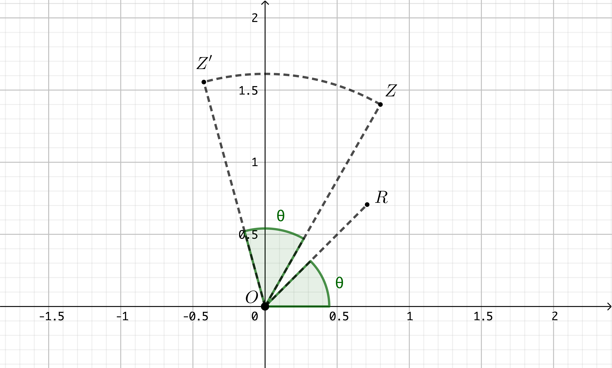

*********
Théorie
*********

1. Propriétés élémentaires
==========================

Nouveaux nombres
----------------

L’équation :math:`x^2+1=0` n’a pas de solution dans l’ensemble des réels
parce qu’il n’y a pas de réel dont le carré vaut -1. Il suffit
d’imaginer que ce nombre existe... Ce nombre est un imaginaire noté
:math:`i`. L’équation a alors pour solution :math:`-i,i`. Et du fait que
le carré de :math:`i` vaut -1, on peut déduire que

.. math:: \forall n\in \mathbb{N}:i^{4n}=1, \quad i^{4n+1}=i,\quad i^{4n+2}=-1,\quad i^{4n+3}=-i

Forme algébrique
----------------

Un nombre complexe est tout de même plus élaboré que ce simple
imaginaire i. On veut que :math:`\mathbb{C}`, l’ensemble des nombres
complexes, prolonge :math:`\mathbb{R}`, l’ensemble des nombres réels.
Tout réel :math:`a` doit donc être un complexe. On veut encore qu’en
multipliant un complexe par un complexe, ce soit un complexe. Ainsi en
multipliant le réel :math:`b` (qui est complexe) par l’imaginaire pur
:math:`i`, on obtient le complexe :math:`bi`. On veut enfin qu’en
additionnant deux complexes, on obtienne un complexe. Ainsi en
additionnant le réel :math:`a` (qui est complexe) au complexe
:math:`bi`, on obtient le complexe :math:`a+bi`.

La forme générale d’un complexe est

.. math:: z=a+bi

:math:`a` étant la partie réelle de :math:`z` (notée :math:`\Re z`) et
:math:`b` la partie imaginaire de :math:`z` (notée :math:`\Im z`),
:math:`a` et :math:`b` tous deux réels.

Deux complexes sont égaux s’ils ont même partie réelle et même partie
imaginaire.

Opérations
----------

Considérons deux complexes :math:`z_{1}=a+bi, \quad z_{2}=c+di`, on
définit assez naturellement l’addition et la multiplication:

.. math:: z_{1}+z_{2}=(a+c)+(b+d)i

.. math:: z_{1}.z_{2}=(ac-bd)+(ad+bc)i

Le neutre pour l’addition est :math:`0+0i=0`. Le symétrique de
:math:`z_{1}` pour l’addition est tout simplement

.. math:: -z_{1}=-a-bi

Le neutre pour la multiplication est :math:`1+0i=1`. Pour obtenir le
symétrique de :math:`z_{1}` pour la multiplication, c’est-à-dire
l’inverse, il faut trouver le complexe :math:`\frac{1}{z_{1}}=x+yi` tel
que

.. math:: (a+bi)(x+yi)=1

Ou encore

.. math:: (ax-by)(ay+bx)i=1+0i

C’est-à-dire que

.. math::

   \begin{cases}
        ax-by=1\\
        bx+ay=0 
   \end{cases}

Ce système de deux équations à deux inconnues a une solution unique si
:math:`a^2+b^2\neq0`, ce qui est le cas pour tout complexe sauf pour
:math:`0+0i`. À cette condition, la solution du système est

.. math::

   x=\frac{\begin{vmatrix}
   1 &-b \\ 
   0 &a
   \end{vmatrix}}{\begin{vmatrix}
   a &-b \\ 
   b &a 
   \end{vmatrix}} =\frac{a}{a^2+b^2},  \quad  y=\frac{\begin{vmatrix}
   a &1 \\ 
   b &0
   \end{vmatrix}}{\begin{vmatrix}
   a &-b \\ 
   b &a 
   \end{vmatrix}} =\frac{-b}{a^2+b^2}

Et

.. math:: \frac{1}{z_{1}}=\frac{a-bi}{a^2+b^2}

On montre sans difficultés que :math:`\mathbb{C},+` et
:math:`\mathbb{C}_{0},.` sont des groupes commutatifs et que
:math:`\mathbb{C},+,.` est un champ.

Forme trigonométrique
---------------------

Dans un repère orthonormé du plan, on peut associer un point à tout
couple de réels. Ainsi, au complexe :math:`z=a+bi`, on peut associer le
point :math:`Z` de coordonnées :math:`(a,b)` (figure 1). On parle de
plan de Gauss dans ce cas, d’axe réel pour l’axe des abscisses et d’axe
imaginaire pour l’axe des ordonnées.

 
     Figure 1

Si dans le plan de Gauss, on associe un point :math:`Z` au complexe
:math:`z`, on peut encore y associer le vecteur ayant l’origine des axes
pour origine et :math:`Z` pour extrémité (figure 2). Ce vecteur a une
longueur :math:`r` et détermine un certain angle :math:`\theta` avec
l’axe des abscisses.

 
     Figure 2 

On voit sans difficultés que

.. math::

   \begin{cases}
       a=r\cos \theta \\
       b=r\sin \theta
   \end{cases}

Inversement,

.. math::

   \begin{cases}
       r^2=a^2+b^2 \\
       \tan\theta=\frac{b}{a}
   \end{cases}

Et on peut écrire que

.. math:: z=a+bi=r(\cos\theta +i \sin \theta )=r \text{cis} \theta

Il s’agit de la forme trigonométrique d’un complexe: :math:`r` est le
module de :math:`z`, on le note également :math:`\left | z \right |`;
:math:`\theta` est l’argument de :math:`z`.

Conjugué
--------

Le conjugué du complexe :math:`z=a+bi` est le complexe
:math:`\overline{z}=a-bi` . Dans le plan de Gauss, à un complexe et son
conjugué correspondent des points qui sont symétriques par rapport à
l’axe :math:`Ox`. On peut vérifier sans difficultés que

.. math:: \overline{\overline{z}}=z \quad \quad z+\overline{z}=2\Re z \quad \quad z-\overline{z}=2\Im z

.. math:: z.\overline{z}=\left (\Re z  \right )^2 +\left ( \Im z \right )^2=\left | z \right |^2

.. math:: \frac{1}{\overline{z}}=\overline{\left ( \frac{1}{z} \right )} \quad \quad \overline{z^2}=\overline{z}^2 \quad \quad \frac{1}{z}=\frac{\overline{z}}{\left | z \right |^2}

Si :math:`v` et :math:`w` sont deux complexes, on peut montrer que

.. math:: \overline{v+w}=\overline{v}+\overline{w} \quad \quad \overline{v.w}=\overline{v}.\overline{w} \quad \quad \overline{\left ( \frac{v}{w} \right )}=\frac{\overline{v}}{\overline{w}}

Inégalité triangulaire
----------------------

Dans le plan de Gauss, deux complexes :math:`v` et :math:`w` étant
associés à des vecteurs de même origine, on peut considérer qu’ils
déterminent un triangle. L’inégalité triangulaire peut donc se traduire
sous forme de complexes et on a

.. math:: \left | v+w \right |\leqslant \left | v \right |+\left | w \right |  \quad \quad \left | v-w \right |\geqslant  \left | v \right |-\left | w \right |

Le module de la somme de deux complexes est plus petit que la somme des
modules. Le module de la différence de deux complexes est plus grand que
la différence des modules.

Produit et quotient
-------------------

En utilisant les formules trigonométriques de :math:`\cos(a\pm b)` et
:math:`\sin(a\pm b)` on démontre sans difficulté que si
:math:`u=r\text{cis}\theta` et :math:`v=s\text{cis}\varphi`, alors

.. math:: u.v=rs\text{cis}(\theta +\varphi ) \quad \quad \frac{u}{v} =\frac{r}{s}\text{cis}(\theta -\varphi )

Ce qui veut dire que pour multiplier deux complexes, on multiplie les
modules et on additionne les arguments, tandis que pour en faire le
quotient, on fait le quotient des modules et on soustrait les arguments.

2. Transformations planes
=========================

Translations
------------

Soit :math:`t=a+bi` un complexe associé au point :math:`T` du plan de
Gauss. On considère la translation de vecteur
:math:`\overrightarrow{OT}` où :math:`O` est l’origine du repère. Le
point quelconque :math:`Z` est envoyé par cette translation sur le point
:math:`Z'` associé au complexe :math:`z'` (figure 3) et

.. math:: z'=z+(a+bi)

  
    Figure 3

Homothéties et symétrie centrale
--------------------------------

On considère l’homothétie de centre :math:`O`, l’origine des axes, et de
rapport :math:`s`. Le point quelconque :math:`Z` est envoyé par cette
homothétie sur le point :math:`Z'` associé au complexe :math:`z'`
(figure 4) et

.. math:: z'=sz

 
     Figure 4

Rotations
---------

Soit :math:`\cos \theta + i \sin \theta` un complexe associé au point
:math:`R` du plan de Gauss. On considère la rotation de centre
:math:`O`, l’origine des axes, et d’angle :math:`\theta`. Le point
quelconque :math:`Z` est envoyé par cette rotation, sur le point
:math:`Z'` associé au complexe :math:`z'` et

.. math:: z'=z(\cos \theta+\sin \theta)

     Figure 5

3. Racines
==========

Formule de Moivre
-----------------

Démontrons par récurrence que pour :math:`n` naturel

.. math:: (\cos\theta +i\sin\theta )^n=\cos{n\theta }+\cos{n\theta }

Pour :math:`n=1`, c’est évident.

Si la propriété est vraie pour :math:`n`, alors

.. math:: (\cos\theta +i\sin\theta )^{n+1}=(\cos\theta +i\sin\theta )^{n}(\cos\theta +i\sin\theta )=(\cos{n\theta }+i\sin{n\theta })(\cos\theta +i\sin\theta )

En distribuant le dernier membre de l’égalité, on a

.. math:: (\cos\theta +i\sin\theta )^{n+1}=(\cos{n\theta }\cos \theta -\sin{n\theta }\sin\theta )+i(\cos{n\theta }\sin\theta +\sin{n\theta }\cos\theta )

En utilisant les formules trigonométriques de :math:`\cos(a+ b)` et
:math:`\sin(a+ b)`, cela devient

.. math:: (\cos\theta +i\sin\theta )^{n+1}=\cos({n\theta +\theta })+i\sin({n\theta+\theta })=\cos{(n+1)\theta }+i\sin{(n+1)\theta }

La propriété est donc vraie pour :math:`n+1`.

Racine carrée par voie algébrique
---------------------------------

Trouver algébriquement les racines carrées d’un nombre complexe
:math:`z=a+bi` (:math:`a` et :math:`b` réels), c’est trouver les réels
:math:`x` et :math:`y` qui satisfont l’équation

.. math:: (x+yi)^2=a+bi

Ou encore

.. math:: x^2-y^2=a

.. math:: 2xy=b

En élevant ces deux égalités au carré et en les additionnant membre à
membre, on obtient successivement

.. math:: x^4+y^4-2x^2y^2=a^2

.. math:: 4x^2y^2=b^2

En additionnant membre à membre les deux égalités précédentes, on a

.. math:: \left ( x^2+y^2 \right )^2=a^2+b^2

On en déduit que

.. math:: x^2+y^2=\pm\sqrt{a^2+b^2}

Il faut cependant rejeter le cas négatif.

Des équations (1) et (3), on tire les valeurs de x et y

.. math:: x=\pm\sqrt{\frac{a+\sqrt{a^2+b^2}}{2}} \quad \quad y=\pm\sqrt{\frac{-a+\sqrt{a^2+b^2}}{2}}

Pour savoir quel signe choisir, on retourne à l”équation (2). Si
:math:`b` est positif, les parties réelle et imaginaire des racines
carrées doivent être de même signe et les racines carrées de
:math:`a+bi` sont

.. math:: \pm\sqrt{\frac{a+\sqrt{a^2+b^2}}{2}}\pm i\sqrt{\frac{-a+\sqrt{a^2+b^2}}{2}}

Si :math:`b` est négatif, les parties réelle et imaginaire des racines
carrées doivent être de signes contraires et les racines carrées de
:math:`a+bi` sont

.. math:: \pm\sqrt{\frac{a+\sqrt{a^2+b^2}}{2}}\mp i\sqrt{\frac{-a+\sqrt{a^2+b^2}}{2}}

Racine :math:`n`-ièmes
----------------------

Pour trouver les racines :math:`n`-ièmes (:math:`n` naturel) d’un nombre
complexe, il est plus simple de l’écrire sous forme trigonométrique.
Ainsi, trouver les racines :math:`n`-ièmes du nombre complexe
:math:`z=r\text{cis}\theta`, c’est trouver les complexes
:math:`s\text{cis}\varphi` tels que

.. math:: \left ( s\text{cis}\varphi \right )^n=r\text{cis}\theta

Par la formule de Moivre, on a

.. math:: s^n\text{cis}n\varphi=r\text{cis}\theta

Pour que deux complexes soient égaux, ils doivent avoir mêmes modules et
mêmes arguments. Dès lors

.. math:: s^n=r \quad \quad n\varphi=\theta+2k\pi \quad (k \text{ entier})

Ce qui veut dire que

.. math:: s=\sqrt[n]{r}\quad \quad \varphi _{0}=\frac{\theta }{n},\varphi _{1}=\frac{\theta }{n}+\frac{2\pi}{n}, \varphi _{2}=\frac{\theta }{n}+\frac{4\pi}{n}, ...,\varphi _{n-1}=\frac{\theta }{n}+\frac{2(n-1)\pi}{n}

On constate que si on donne d’autres valeurs à :math:`k` que les valeurs
0,1, ...,\ :math:`n-1`, on en revient à des racines déjà reprises. Un
complexe (et un réel en particulier) a donc :math:`n` racines
:math:`n`-ièmes complexes (dont certaines peuvent être réelles).

Sachant que toutes ces racines ont même module et des arguments en suite
arithmétique de raison :math:`\frac{2\pi}{n}`, elles forment un polygone
régulier à :math:`n` côtés (quand :math:`2 < n`) dans le plan de Gauss.
Ces racines forment également une suite géométrique de raison
:math:`\text{cis}\left (\frac{2\pi}{n} \right )` car

.. math:: \text{cis}\left (\frac{k2\pi}{n} \right )=\left ( \text{cis}\left (\frac{2\pi}{n} \right ) \right )^k

Au paragraphe précédent nous avons vu comment calculer les racines
carrées à partir de la forme algébrique d’un complexe. Par ce que nous
venons de voir pour les racines :math:`n`-ièmes, on peut aussi les
calculer à partir de leur forme trigonométrique. Les deux racines
carrées du complexe :math:`z=r\text{cis}\theta` sont

.. math:: \sqrt r\text{cis} \frac{\theta }{2} \quad \quad \sqrt r\text{cis}\left ( \frac{\theta }{2} +\pi\right)

4. Équations du second degré
=============================

À coefficients réels
--------------------

Considérons tout d’abord une équation à coefficients réels

.. math:: ax^2+bx+c=0

On sait que dans :math:`\mathbb{R}`, elle a deux solutions distinctes
quand le réalisant :math:`\Delta =b^2-4ac` est strictement positif et
une solution double quand :math:`\Delta` est nul. Si :math:`\Delta` est
négatif, alors :math:`\Delta =i^2(-\Delta )` et l’équation a deux
racines complexes

.. math:: x=\frac{-b\pm i\sqrt{-\Delta }}{2a}

À coefficients complexes
------------------------

Si l’équation du second degré :math:`ax^2+bx=c=0` est à coefficient
complexes, on la résout de la même manière qu’une équation à
coefficients réels et on obtient les solutions

.. math:: x_{1}=\frac{-b+ i\alpha }{2a}\quad \quad x_{2}=\frac{-b+ i\beta  }{2a}

où :math:`\alpha` et :math:`\beta` sont les racines carrées du complexe
:math:`\Delta =b^2-4ac`.