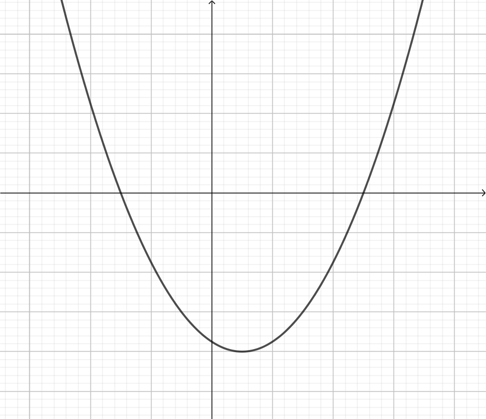

**********************
Primitives - exercices
**********************

.. note:: Des astuces sont disponibles via le bouton Hint en haut à droite si vous ne parvenez pas à résoudre l'exercice et des pistes vous sont données lorsque vous soumettez une mauvaise réponse.

Exercices pré-test
==================

Les exercices suivants sont issus du test du début du module. Vous avez désormais un nombre illimité de tentatives pour essayer de les résoudre.

Exercice n°1
------------

.. inginious:: m4_primitives_01

Exercice n°2
------------

.. inginious:: m4_primitives_02

Exercice n°3
------------

.. inginious:: m4_primitives_03

Exercice n°4
------------

.. inginious:: m4_primitives_04

Exercice n°5
------------

.. inginious:: m4_primitives_05

.. inginious:: m4_primitives_05_supp

Exercice n°6
------------

.. inginious:: m4_primitives_06

Exercices supplémentaires
=========================

Vous avez un nombre illimité de tentatives pour essayer de résoudre les exercices suivants.

Exercice n°7
------------

.. inginious:: m4_primitives_07

Exercice n°8
------------

.. inginious:: m4_primitives_08

Exercice n°9
------------

.. inginious:: m4_primitives_09

Exercice n°10
-------------

.. inginious:: m4_primitives_10

Exercice n°11
-------------

.. inginious:: m4_primitives_11

Exercice n°12
-------------

.. inginious:: m4_primitives_12

Exercices bonus
===============

.. note:: Ces questions n'ont ni solution, ni indice. Soit vous êtes sûr de votre réponse, soit vous en référez à un autre étudiant, soit vous posez la question en séance présentielle d'exercices.

Exercice n°13
-------------

Déterminez les primitives des fonctions suivantes :

a) :math:`\int {e^x(1-2e^x)}dx`

b) :math:`\int {\frac{1}{(x-3)^2}-\frac{4}{(x+2)}}dx`

c) :math:`\int {\frac{x}{\sqrt {1-x^2}}}dx`

d) :math:`\int {\frac{1}{x\ln x}}dx`

e) :math:`\int {x^2\ln x}dx`

f) :math:`\int {\frac{\sin x}{\cos^3 x}}dx`

Exercice n°14
-------------

Faites le graphique d'une primitive de la fonction représentée ci-dessous.

.. image:: img/8.png

 
Exercice n°15
-------------

Une fonction est représentée ci-dessous, précisez l'allure que peuvent avoir toutes les primitives de cette fonction. 

Quelles sont les possibilités en termes d'extrema (nombre et type) pour les primitives de ces primitives?

