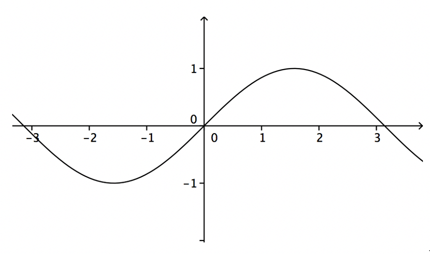
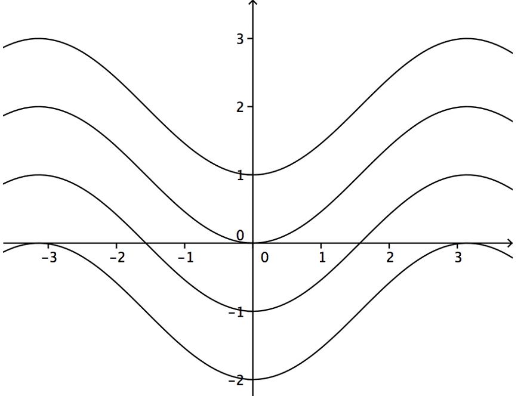
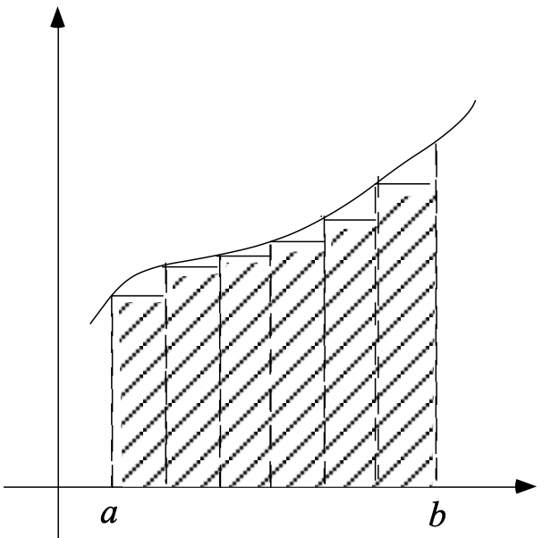
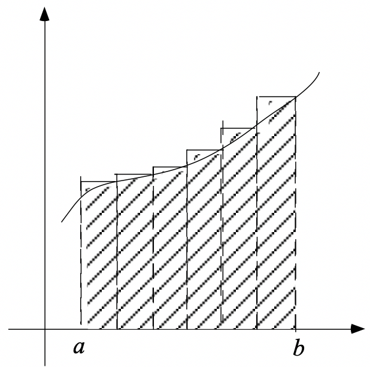
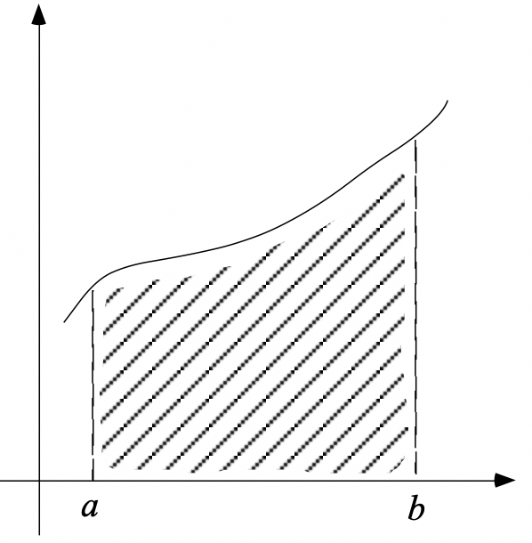
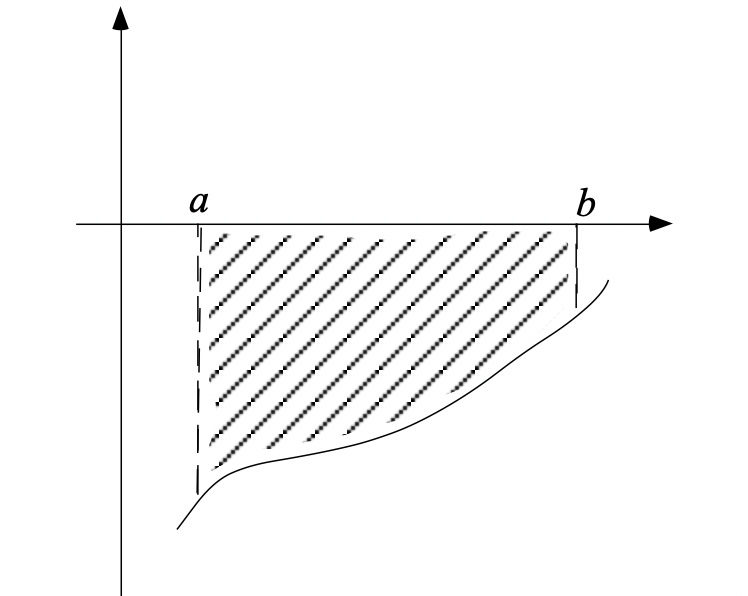
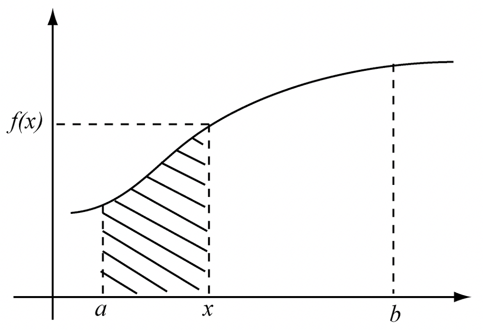
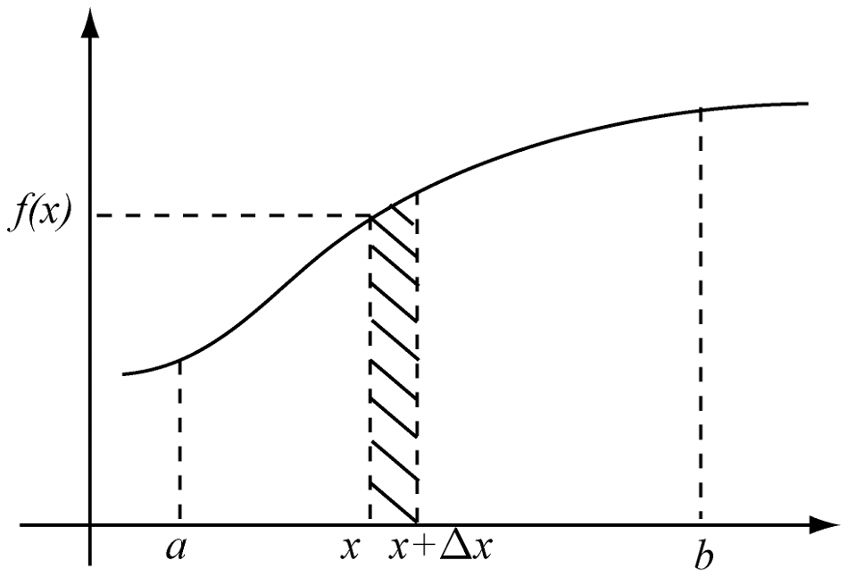
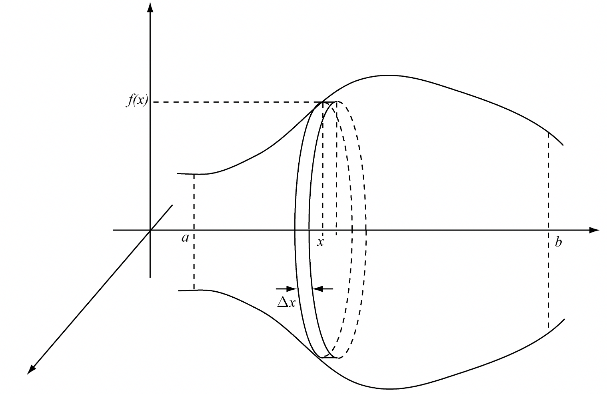
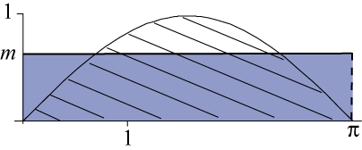

*******
Théorie
*******

1. Primitive
============

Définition
----------

Soit :math:`f` une fonction réelle définie sur un intervalle réel
:math:`I`. :math:`f` est primitivable sur :math:`I` s’il existe une
fonction :math:`F` de :math:`\mathbb{R}` dans :math:`\mathbb{R}`,
dérivable sur :math:`I` et telle que

.. math:: \forall x\in I:F'(x) = f(x)

Une telle fonction s’appelle une primitive de :math:`f` sur :math:`I`.

Proposition
-----------

Soit :math:`f` de :math:`\mathbb{R}` dans :math:`\mathbb{R}`
primitivable sur l’intervalle réel :math:`I`. Si :math:`F` est une
primitive de :math:`f` sur :math:`I` ,

alors :math:`G` de :math:`\mathbb{R}` dans :math:`\mathbb{R}` est une
primitive de :math:`f` sur :math:`I` si et seulement si F-G est
constante sur I.

Corollaire
----------

Soit :math:`f` une fonction de :math:`\mathbb{R}` dans
:math:`\mathbb{R}`, définie sur l’intervalle :math:`I`. Pour tout
:math:`a\in I` et pour :math:`c\in \mathbb{R}`, il existe une primitive
:math:`F` de :math:`f` telle que

.. math:: F(a) = c

Prenons un exemple. À la ::numref:`Figure <fig1>`, on a représenté une fonction. A la
figure 2, on peut voir quelques primitives de cette fonction sur
l’intervalle [-3,3]. Le corollaire ci-avant exprime que par tout point
du plan dont l’abscisse est située dans l’intervalle adéquat, passe le
graphique d’une primitive.

    Figure 1

On note

.. math:: \int f(x)dx

l’ensemble des primitives de la fonction :math:`f` sur un intervalle
donné.

Primitives immédiates
---------------------

.. math:: \int rdx=rx+k \quad (r\in \mathbb{R})

.. math:: \int x^p dx=\frac{x^{p+1}}{p+1}+k \quad (p\in\mathbb{Q}\setminus {\left \{ -1 \right \}})

.. math:: \int \frac{1}{x}dx=\ln\left | x \right |+k

.. math:: \int \sin xdx= -\cos x +k

.. math:: \int \cos xdx= \sin x +k

.. math:: \int \frac{1}{\cos^2{x}}dx=\tan x +k

.. math:: \int e^xdx=e^x

.. math:: \int \frac{1}{\sqrt{1-x^2}}dx=\arcsin x +k

.. math:: \int \frac{1}{x^2}dx=\arctan x +k

Propriétés
----------

.. math:: \int rf(x)dx=r\int f(x)dx  \quad (r\in \mathbb{R})

.. math:: \int f(x)+g(x)dx=\int f(x)dx+ \int g(x)dx

Primitivation par parties
-------------------------

Soient :math:`f` et :math:`g` deux fonctions à valeurs dans
:math:`\mathbb{R}`, dérivables sur un intervalle :math:`I` réel. Alors
:math:`f'g` est primitivable sur :math:`I` si et seulement si
:math:`fg'` l’est, auquel cas

.. math:: \int f'(x)g(x) dx=f(x)g(x)-\int f(x)g'(x) dx

La démonstration se déduit de la formule de dérivation de :math:`fg`.
Comme

.. math:: \left ( fg \right )'(x)=f'(x)g(x)+f(x)g'(x)

On peut en déduire, en utilisant la propriété (2) du paragraphe 1.5, que

.. math:: \int \left ( fg \right )'(x)=\int f'(x)g(x) dx + \int f(x)g'(x) dx

Ce qui nous conduit aisément à l’égalité à démontrer.

Illustrons cette méthode de primitivation par un exemple. Soit à
calculer

.. math:: \int \ln x dx

Si on pose :math:`f'(x)=1`, :math:`g(x)=\ln x`, il en résulte que
:math:`f(x)=x`, :math:`g'(x)=1/x` et grâce au théorème de primitivation
par partie, on a :

.. math:: \int 1 \ln x dx=x\ln x -  \int x \frac{1}{x} dx=x\ln x-x+k

Primitivation par substitution
------------------------------

Le théorème
~~~~~~~~~~~

La dérivée de la composée de deux fonctions est un produit. Si la
fonction :math:`f` est dérivable en une valeur :math:`x` de son domaine,
si la fonction :math:`g` est définie et dérivable en f(x),

alors :math:`g \circ  f` est dérivable en :math:`x` et

.. math:: \left (g \circ  f  \right )'(x)= \left (g (f)  \right )'(x)=g'\left (f(x) \right) f'(x)

Si on primitive les deux membres de l’égalité, sachant qu’une primitive
de la dérivée d’une fonction est la fonction elle même, on a

.. math::

   \int g'\left (f(x) \right) f'(x)dx=g (f(x))+k
   \label{1}

Pourquoi parle-t-on de substitution? Parce qu’une façon de faire
consiste à substituer une variable :math:`t` à la variable :math:`x`.
Pratiquement, on pose :math:`t=f(x)`. Comme :math:`f'(x)` exprime la
variation de :math:`t` par rapport à :math:`x`, on écrit encore que
:math:`dt=f'(x)dx`, que l’on nomme différentielle.

Ce qui nous conduit à une reformulation de l’égalité (4):

.. math::

   \int g'\left (f(x) \right) f'(x)dx=\int g'(t)dt
   \label{2}

Une fois la primitivation en :math:`t` effectuée, on remplace :math:`t`
par sa valeur en fonction de :math:`x`.

Deux primitivations particulières s’avèrent presque immédiates à la
suite du résultat (4):

.. math:: \int \frac{f'(x)}{f(x)}dx=\ln\left | f(x) \right |+k

Dans ce cas :math:`g'(t)= \frac {1}{t}`.

.. math:: \int f'(x)f^p (x)dx=\frac{f^{p+1}(x)}{p+1}+k \quad (p\neq -1)

Dans ce cas :math:`g'(t)= t^p`.

Illustrons le première. Soit à calculer

.. math:: \int \tan x dx

En écrivant la tangente comme quotient du sinus et du cosinus, l’opposé
du sinus étant la dérivée du cosinus, on a :

.. math:: \int \tan x dx=-\int \frac{-\sin x}{\cos x}dx=\ln\left | \cos x \right |+k

Prenons un autre exemple de substitution qui ne relève pas de ces deux
cas particuliers (6) et (7). Soit à calculer

.. math:: \int xe^{x^2+1} dx

On pose :math:`t=x^2+1`, :math:`dt=2xdx` et :math:`g't)=e^t`. Dés lors

.. math:: \int xe^{x^2+1}dx=\frac{1}{2} \int e^{t}dt=e^t+k=\frac{e^{x^2+1}}{2}=k

Un autre lecture
~~~~~~~~~~~~~~~~

L’égalité (5) est valable quelles que soient les variables et les
fonctions... Si on la lit de droite à gauche en substituant :math:`x` à
:math:`t`, :math:`t` à :math:`x` et :math:`h` à :math:`f`, on a

.. math::

   \int g'(t)dt= \int g'\left (h(x) \right) h'(x)dx
   \label{2}

Dans une première lecture de la primitivation par substitution, on avait
posé :math:`t=fx)`. Dans le cas présent (on parle également de
changement de variables), on pose :math:`x=h(t)` et :math:`dx=h'(t)dt`.
Mais c’est toujours le même théorème.

2. Intégrale
============

Pour calculer l’aire sous une courbe, une méthode consiste à approcher
cette aire par une somme d’aires de rectangles. Si la fonction est
positive et croissante, on peut considérer une fonction en escalier qui
minore la fonction (figure 3) et une autre qui la majore (figure 4). En
prenant de plus en plus de rectangles ayant des bases d’autant plus
petites, on approche d’autant mieux l’aire cherchée.

.. _définition-1:

Définition
----------

Soit :math:`f` est une fonction définie sur un intervalle réel
:math:`[a,b]`, on divise cet intervalle en :math:`n` sous-intervalles de
largeur égale [1]_. Les bornes de ces intervalles sont

.. math:: a=a_{0},a_{1},...,a_{n-1},a_{n}=b

On choisit un valeur à l’intérieur de chaque sous-intervalle

.. math:: x_{i}\in [a_{i-1},a_{i}]\quad (i=1,2,...,n)

Si :math:`f` est continue sur :math:`[a,b]`, alors :math:`f` est
intégrable sur :math:`[a,b]` et l’intégrale définie de :math:`f` depuis
:math:`a` jusque :math:`b` vaut

.. math:: \int_{a}^{b}f(x)dx=\lim_{n \to\infty  }\sum_{i=1}^{n}(a_{i}-a_{i-1})f(x_{i})

la limite étant indépendante du choix des :math:`x_{i}` . Dans
l’hypothèse de largeur constante des intervalles, cela devient

.. math:: \int_{a}^{b}f(x)dx=\lim_{n \to\infty  }\sum_{i=1}^{n}\frac{b-a}{n}f(x_{i})

Aire et intégrale
-----------------

Géométriquement, l’intégrale définie :math:`\int_{a}^{b}f(x)dx`
correspond à l’aire comprise entre le graphique de la fonction
:math:`f`, l’axe des abscisses et les droites d’équations :math:`x = a`
et :math:`x =  b` (figure 5) lorsque la fonction est positive.

Par contre, lorsque la fonction est négative (figure 6), l’intégrale est
négative. Pour trouver l’aire comprise entre le graphique et l’axe des
abscisses, il faut prendre l’opposée de l’intégrale.

.. _propriétés-1:

Propriétés
----------

Ces propriétés découlent assez naturellement de la définition
d’intégrale définie.

.. math:: \int_{a}^{a}f(x)dx=0

.. math:: \int_{b}^{a}f(x)dx=-\int_{a}^{b}f(x)dx

.. math:: \int_{a}^{b}f(x)dx+\int_{b}^{c}f(x)dx=\int_{a}^{c}f(x)dx

.. math:: \int_{a}^{b}rf(x)dx=r\int_{a}^{b}f(x)dx\quad (r\in\mathbb{R})

.. math:: \int_{a}^{b}\left ( f(x)+g(x) \right )dx=\int_{a}^{b}f(x)dx+\int_{a}^{b}g(x)dx

Théorème fondamental
--------------------

Si :math:`f` est une fonction de :math:`\mathbb{R}` dans
:math:`\mathbb{R}` continue et primitivable sur un intervalle
:math:`[a,b]`, si :math:`F` est une primitive de :math:`f` sur cet
intervalle, considérons la fonction :math:`G` appelée intégrale
généralisée et définie comme suit

.. math:: \forall x\in[a,b]:G(x)=\int_{a}^{x}f(t)dt

Si :math:`f` est positive [2]_, :math:`G(x)` est assimilable à l’aire
hachurée de la figure 7. Calculons la dérivée de G, on a

.. math:: G'(x)=\lim_{\Delta x\rightarrow 0}\frac{G(x+\Delta x)-G(x)}{\Delta x}

Comme toute dérivée, il s’agit de la limite d’un taux d’accroissement.
La différence, au numérateur de ce taux, correspond à l’aire hachurée de
la figure 8, c’est-à-dire l’aire d’un rectangle infinitésimal. Si on
divise cette différence par la largeur :math:`\Delta x` de ce rectangle,
on obtient la hauteur du rectangle, à savoir :math:`f(x)` (quand
:math:`\Delta x` devient très petit). En résumé,

.. math:: G'(x)=f(x)

Comme :math:`f` est primitivable, :math:`F` étant une primitive de
:math:`f`, on peut écrire, à partir des propriétés des primitives, que
(:math:`k` étant un réel)

.. math:: G(x)=F(x)+k

ou encore

.. math:: \forall x\in[a,b]:\int_{a}^{x}f(t)dt=F(x)+k

Quand :math:`x = a`, on a

.. math:: \int_{a}^{a}f(t)dt=F(a)+k

Comme le premier membre de l’égalité est nul, on peut en déduire que

.. math:: k=-F(a)

Quand :math:`x = b`, on a

.. math:: \int_{a}^{b}f(t)dt=F(b)-F(a)

Cela nous donne le moyen de calculer une intégrale définie: pour ce
faire, il faut chercher une primitive de la fonction et la calculer aux
bornes de l’intervalle d’intégration. Prenons un exemple. Soit à
calculer l’aire déterminée par l’axe des abscisses et le graphique de la
fonction sinus entre 0 et :math:`\pi` (figure 1). Cette aire est égale à

.. math:: \int_{0}^{\pi}\sin x dx=\left [ -\cos x \right ]_{0}^{\pi}=-\cos \pi-(-\cos 0)=-(-1)-(-1)=2

3. Volume
=========

Considérons une fonction continue sur un intervalle :math:`[a,b]` réel.
Considérons également le solide de révolution engendré par la rotation
autour de l’axe :math:`0x`, de la surface plane délimitée par le
graphique de :math:`f` et l’axe :math:`0x`. On veut calculer le volume
de ce solide de révolution. Pour déterminer l’aire sous le graphique, on
a considéré une subdivision de l’intervalle :math:`[a,b]` en :math:`n`
sous-intervalles et une fonction en escalier (constante sur chaque
sous-intervalle) qui approche la fonction considérée. Si on fait encore
de même, chaque palier de la fonction en escalier va engendrer en
tournant autour de l’axe :math:`Ox`, un cylindre (figure 9) et la
fonction en escalier dans son entièreté engendrera un empilement de
cylindres. Chaque cylindre dont la base est située à l’abscisse x a pour
volume

.. math:: \pi\left ( f(x) \right )^2\Delta x

En passant à la limite sur :math:`n`, on obtiendra le volume du solide
de révolution qui vaut donc

.. math:: \int_{a}^{b}\pi\left ( f(x) \right )^2dx

4. Moyenne d’une fonction
=========================

La valeur moyenne d’une fonction :math:`f` sur un intervalle
:math:`[a,b]` est le réel

.. math:: m=\frac{1}{b-a}\int_{a}^{b} f(x)dx

Pour une fonction positive, c’est un réel tel que l’aire "sous la
courbe" entre :math:`a` et :math:`b` soit égale à l’aire du rectangle de
dimensions :math:`b-a` et :math:`m`.

La valeur moyenne de la fonction sinus sur :math:`[0,\pi]` vaut
:math:`\frac{2}{\pi}` (figure 10). La valeur moyenne de cette même
fonction sur :math:`[0,2\pi]` est égale à 0.

5. Mouvements
=============

Il a été vu précédemment que, dans un mouvement rectiligne, la vitesse
est obtenue comme dérivée de la position en fonction du temps.
L’accélération est, quant à elle, la dérivée de la vitesse. Dès lors,
pour déterminer la fonction position à partir de la fonction vitesse, il
faut chercher les primitives de la vitesse. Pour déterminer la fonction
vitesse à partir de la fonction accélération, il faut chercher les
primitives de l’accélération. Pour déterminer les constantes :math:`k`
adéquates, on se réfère aux conditions initiales. Considérons, par
exemple, un corps de 10 kg en chute libre, après avoir été lancé avec
une vitesse initiale de 5 m /sec vers le haut et d’une hauteur de 13 m.
Son accélération est celle de la pesanteur, à savoir :math:`g` ou -9,81
m/sec. On a donc

.. math:: a(t)=g

On peut en déduire que

.. math:: v(t)=\int gdt=gt +k

Pour déterminer :math:`k`, on s’intéresse au temps :math:`t = 0`. On
sait que la vitesse initiale est de 5 m/sec. D’où

.. math:: v(t)=gt +5

Pour la position, on a

.. math:: e(t)=\int gt +5dt=\frac{gt^2}{2}+5t+k

Quand t = 0,

.. math:: 0+0+k=13

Finalement

.. math:: e(t)=\frac{-9.81 t^2}{2}+5t+13

6. Travail
==========

Si un corps est soumis à une force variable en fonction de la position,
le travail produit par la force est égal à

.. math:: T=\int_{s_{1}}^{s_{2}}F(s)ds

où :math:`s` est l’espace parcouru et :math:`F(s)` est la composante de
la force dans la direction du déplacement.

Considérons à titre d’exemple, le travail fourni par un ressort de
raideur :math:`k=80` newtons par mètre. Pour revenir à sa position
initiale quand il est étiré de 10 cm. La force de rappel est
:math:`F(x)=-80x`, si :math:`x` donne sa position à partir de sa
position au repos. Et le travail effectué vaut

.. math:: \int_{0}^{\frac{1}{10}}-80xdx=\left [ \frac{-80x^2}{2} \right ]_{\frac{1}{10}}^{0}=-0.4 \text watt

.. [1]
   Ce n’est pas obligatoire de prendre une largeur d’intervalle
   constante sachant que de toutes façons, on fait tendre le nombre
   d’intervalles vers l’infini et que la largeur de tous les intervalles
   va tendre vers 0.

.. [2]
   Nous choisissons :math:`f` positive pour la facilité du raisonnement
   mais le résultat reste le même quel que soit le signe de la fonction.
