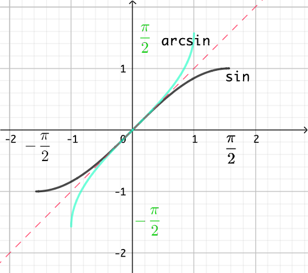
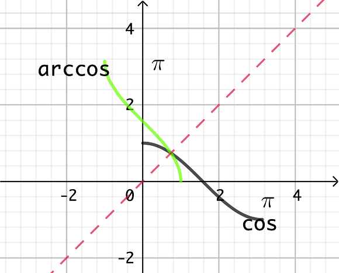
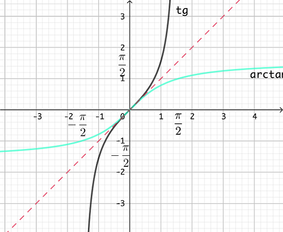
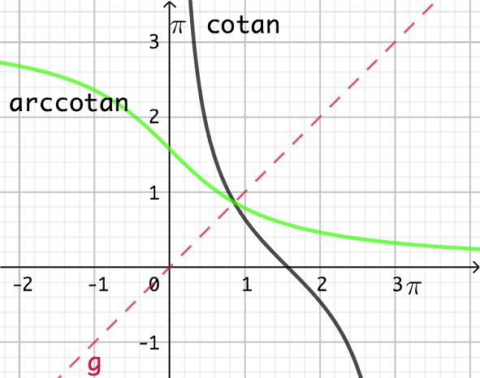

******************************
Théorie
******************************

Les fonctions réciproques
==========================

1. Rappels
-----------

Une *fonction* est une relation entre deux ensembles telle que chaque nombre ait maximum une image.

:math:`dom f=\{ x \in \mathbb{R} \mid f(x)` existe :math:`\}`

:math:`Im f = \{y \in \mathbb{R} \mid \exists` au moins un :math:`x \in \mathbb{R}` pour lequel :math:`f(x)=y \}`

- Pour que la réciproque de :math:`f` soit une fonction, il faut qu’à chaque élément de :math:`Im f` corresponde *un seul* élément du domaine de :math:`f` .

Si ce n’est pas le cas, il faut *restreindre le domaine* de :math:`f` pour la rendre bijective ( c-à-d qu’à chaque élément du domaine corresponde un seul élément de l’ensemble image et réciproquement).

2. Définition
--------------

Si :math:`f` est une bijection de A vers B (avec A :math:`\subset \mathbb{R}` et B :math:`\subset\mathbb{R}` )

alors :math:`f^{-1}` existe et est une bijection de B vers A telle que si :math:`f(a)=b, f^{-1}(b)=a` .

Le *graphe* d’une réciproque s’obtient dans un repère orthonormé par une symétrie orthogonale d’axe :math:`y=x` , ce qui a pour effet d’inverser les axes et d’envoyer un point (a,b) sur un point (b,a).

Pour trouver l’ *équation* d’une réciproque, on intervertit :math:`x` et :math:`y` dans l’expression de :math:`f(x)` et on résout l’équation en :math:`y` .

Attention: l’exposant -1 a 2 significations; c’est le contexte qui précise si :math:`f^{-1}` est l’inverse ou la réciproque de :math:`f` . C’est ce dernier sens qui est le plus fréquent.

3. Dérivée d’une fonction réciproque
-------------------------------------

.. math:: (f^{-1})'(x)=\frac{1}{f'(f^{-1}(x))}

On peut démontrer ce résultat

-  algébriquement, en utilisant le fait que la composée d’une fonction et de sa réciproque est l’identité et en dérivant les deux membres de l’égalité.

-  géométriquement, en utilisant le fait que, les deux graphes étant symétriques, leurs tangentes à des points correspondants le sont aussi et donc que leurs pentes sont inverses.

Les fonctions cyclométriques
=============================

:math:`\mathbf{arcsin}` :

:math:`[ -1,1]   \rightarrow  [-\frac{\pi}{2},\frac{\pi}{2}]`

:math:`\hspace*{1cm}  x \rightarrow y = \arcsin x` tel que

.. math:: 

    \begin{cases}
       \sin y = x\\
       -\frac{\pi}{2}\leqslant y \leqslant   \frac{\pi}{2} 
    \end{cases}

:math:`(arcsinx)'=\frac{1}{\sqrt{1-x^2}}`

:math:`\mathbf{arccos}`

:math:`[ -1,1] \rightarrow [0,\pi]`

:math:`\hspace*{1cm} x \rightarrow y = \arccos x` tel que

.. math::

     \begin{cases}
        \cos y =x\\
        0\leqslant y\leqslant \pi
     \end{cases}

:math:`(\arccos x)'=\frac{-1}{\sqrt{1-x^2}}`

:math:`\mathbf{arctan}`

:math:`\mathbb{R} \rightarrow ]-\frac{\pi}{2},\frac{\pi}{2}[`

:math:`x  \rightarrow y = \arctan x` tel que

.. math::

     \begin{cases} 
       \tan y =x\\
       -\frac{\pi}{2}  <y. < \frac{\pi}{2}
     \end{cases}

:math:`(arctan x)'=\frac{1}{1+x^2}`

:math:`\mathbf{arccotan}`

:math:`\mathbb{R} \rightarrow ]0, \pi[`

:math:`x \rightarrow y = arcotan(x)` tel que

.. math::

   \begin{cases}
       \textrm{cotan} (y)=x\\
       0<x< \pi
   \end{cases}

:math:`(arccotan(x))'= \frac{-1}{a+x^2}`

